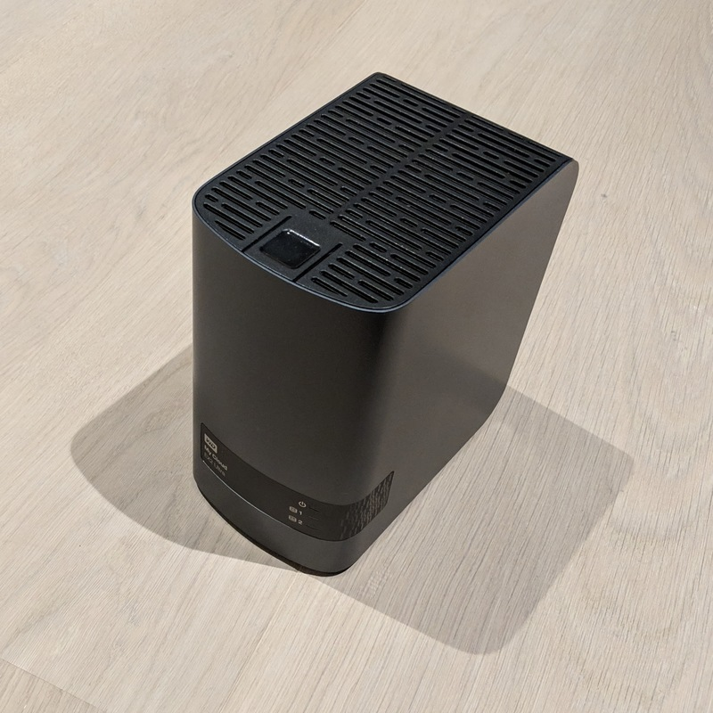

# NAS

It's a Western Digital My Cloud EX2 Ultra.

The 4TB version was £264.97 on [Amazon][nas_amazon].



[nas_amazon]: https://www.amazon.co.uk/WD-TB-Cloud-EX2-Ultra/dp/B01BIGSSHQ/

## Features

### iSCSI

Unlike most home NAS devices this one comes with iSCSI. This is absolutely optional for a Raspberry Pi cluster, but gives the option of booting up the Raspberry Pis without an SD card.

### SSH

It's possible to enable SSH access to the NAS, which gives extra functionality, but it comes with a few caveats.
WD's website warns with:

**Critical:** The use of SSH (Secure Shell) can potentially harm the My Cloud EX2 Ultra device and could result in loss of access to the device and/or data.
**The use of SSH to modify or attempt to modify the device outside of the normal operation of the product voids your WD warranty.**

I'm not going to question what do they mean by *normal operation*.

### Docker

It's possible to install a few [3rd party applications](https://support.wdc.com/knowledgebase/answer.aspx?ID=16513).

As you can tell it's not too many and EX2 Ultra doesn't officially support Git, which I found odd.
Not as odd though than finding a Docker service running on the NAS.

It's a version from 2015:

```
root@MyCloudEX2Ultra root # docker -v
Docker version 1.7.0, build 0baf609
```

Out of the box the Docker daemon is not running anything, maybe one day the whole thing disappear with a firmware upgrade if WD feels like, but I take it for now.

The NAS has ARM architecture. I couldn't get the ARM Alpine image running, but the [arm32v7][arm32v7] images worked.
I've made a git container based on `arm32v7/ubuntu`, you can build it from [source][git_github] or download it from Docker [hub][git_docker] if you're interested.

[arm32v7]:    https://hub.docker.com/u/arm32v7
[git_docker]: https://hub.docker.com/r/matefarkas/git-arm32v7
[git_github]: https://github.com/farkasmate/docker_git-arm32v7

## Notes

It worth to mention that it's a quiet device, but not silent, it has two HDDs and a fan. I'm not going to keep in in my living room.
